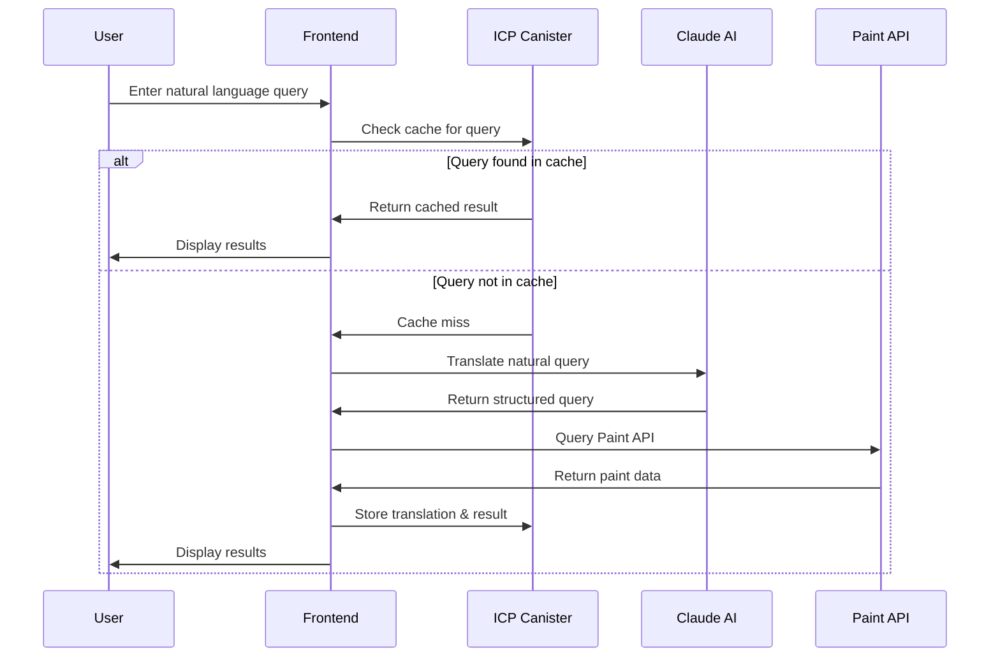

# Paint Query Translator

A teaching project demonstrating the integration of Internet Computer Protocol (ICP) canisters with AI language processing. The system translates natural language queries about paint into structured API calls, with results cached on the blockchain.

## System Components

The project consists of three main services:

1. **Paint API Service**: A local REST API serving paint data

   - Provides detailed paint specifications, application conditions, and safety information
   - Supports queries by code, name, temperature requirements, and VOC levels

2. **ICP Canister**: Blockchain-based caching system

   - Stores translations and API responses
   - Provides persistent storage (survives server restarts)
   - Only cleared when explicitly requested via `dfx start --clean`

3. **Claude AI Integration**: Natural language processing
   - Translates user queries into structured API calls
   - Uses system prompts for consistent translations

Here's how these components interact:



## Prerequisites

- Node.js (>=16.0.0)
- npm (>=7.0.0)
- dfx (ICP SDK)
- An Anthropic API key for Claude AI access
- WSL if using Windows (dfx doesn't run natively on Windows)

## Environment Setup

1. Copy `.env.example` to `.env`
2. Add your Anthropic API key:
   ```
   VITE_CLAUDE_API_KEY=your-api-key-here
   ```

## Installation & Running

```bash
# Install and start the Paint API
cd paint-api
npm install
node server.js

# In a different terminal
# Install ICP project dependencies
cd translator-canister
npm install

# Start the ICP replica (in background)
dfx start --background --clean

# Deploy canisters to the replica
dfx deploy

# Start the Vite development server
npm start
```

The application will be available at `http://localhost:8080`
The Paint API will be running at `http://localhost:3000`

## Using the Application

1. **Natural Language Queries**: Enter queries like:

   - "What paints work at 40 degrees?"
   - "Show me paint AX-117-R"
   - "Find paints with VOC under 35"

2. **Cache Management**:
   - Use "Clear Cache" button to reset the in-memory cache
   - Use "Display Cache" to see all cached translations
   - Note: The cache persists across server restarts due to blockchain storage
   - To completely reset the cache, stop the replica and restart with `dfx start --background --clean`

### ICP Project Structure

```
.
├── .env                           # Environment variables
├── dfx.json                       # ICP canister configuration
├── package.json                   # Project dependencies and scripts
│   └── translator-canister-frontend/
│       ├── assets/               # Static assets
│       ├── src/
│       │   ├── App.js           # Main application component
│       │   ├── index.css        # Global styles
│       │   ├── main.js          # Application entry point
│       │   └── services/
│       │       ├── paintApiService.js    # Paint API client
│       │       └── translationService.js  # Claude AI integration
│       ├── index.html           # Main HTML template
│       └── vite.config.js       # Vite configuration
```

Key directories and files:

- `/src/translator-canister-backend/`: Contains the Motoko code for the ICP canister that implements our caching system
- `/src/translator-canister-frontend/`: Houses the frontend application
- `/src/declarations/`: Auto-generated by dfx, contains type definitions and interfaces for interacting with the canisters
- `dfx.json`: Defines the canister configuration for both backend and frontend
- `.env`: Contains environment variables (Claude API key and Paint API URL)

### Paint API Details

The Paint API supports the following query parameters:

- `code`: Exact match for paint code (e.g., "AX-117-R")
- `name`: Case-insensitive paint name search
- `temperature`: Find paints suitable for a specific temperature
- `maxvoc`: Find paints with VOC levels below a specified limit

Example queries:

```bash
# Get all paints
curl http://localhost:3000

# Find paint by code
curl http://localhost:3000?code=AX-117-R

# Find paints suitable for 35°C
curl http://localhost:3000?temperature=35

# Find paints with VOC <= 40
curl http://localhost:3000?maxvoc=40
```

## Key Components

### ICP Canister

- Implements caching logic in Motoko
- Stores translations and API responses permanently on the blockchain
- Provides query/storage interfaces
- Cache persists until explicitly cleared with `dfx start --background --clean`

### Translation Service

- Integrates with Claude AI
- Converts natural language to structured queries
- Uses system prompts for consistent translations

## Common Issues & Solutions

1. **WSL Users**

   - Ensure all commands are run within WSL
   - The Paint API server must be accessible from WSL

2. **Canister Deployment**

   - If changes aren't reflecting, try `dfx deploy --clean`
   - Check replica status with `dfx status`

3. **Frontend Development**

   - Port conflicts can be resolved in `vite.config.js`
   - Environment variables must be prefixed with `VITE_`

4. **Cache Persistence**
   - The cache is stored on the blockchain and persists across restarts
   - `Clear Cache` button only clears the current canister's memory
   - For a complete reset, use `dfx start --clean`

## Learning Resources

- [Internet Computer Documentation](https://internetcomputer.org/docs/current/developer-docs/ic-overview)
- [Claude AI Documentation](https://docs.anthropic.com/claude/docs)
- [Vite Documentation](https://vitejs.dev/guide/)
